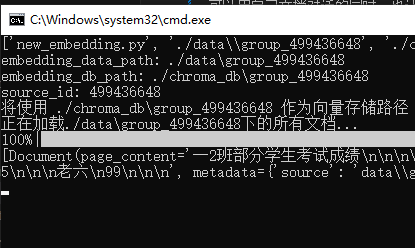
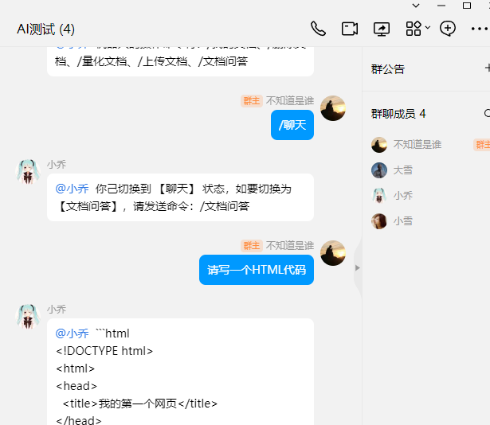
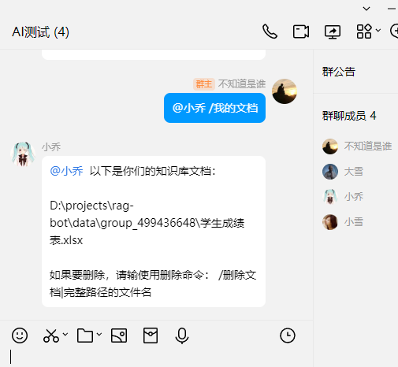

# 元龙版RAG
## 简介
元龙版RAG是一个以QQ聊天界面作为语言模型与用户交互端的RAG应用。做这样一个应用，早有想法。从元龙山回来后，心神俱废，日渐消沉，需要拾起以前感兴趣的东西来调节自己，虽然年事己高，仍然觉得hello word是一个不错的东西。于是一直研究nonebot，可是弄了个来月，不得所以，于是明白：它经过高度封装后有了自己的一套，对于个人而言，学习它将付出更大的学习成本，于是决定自己写一个bot。现在这个bot有这些好处：一是它很方便地用QQ进行各种问答和控制操作，二是它借助了QQ强大的社交功能，使得它的推广和使用成本很低。三是支持群文档和个人文档，它在让个人可以用自己文档对话的同时，也让群就某一领域讨论与学习变得更加智能。
## 部分界面载图





## 怎样使用
### 安装环境
- 推荐使用conda环境安装部署，首先你得安装好conda环境
```bash
conda create -n rag-bot-pub python=3.11
git clone https://github.com/bifu123/rag-bot-pub
cd rag-bot-pub
conda activate rag-bot-pub
pip install requirements.txt
```
### 修改配置文件config.py
请根据文件中提示，结合你的实际情况修改，其中涉及了对接ollama和go-cqhttp的部分，如果不会，先补上这部分知识，可以参看我在b站上的视频，也可以加QQ群：222302526 

### 启动程序
```bash
python listen_ws.py
```
程序启动后，它会用socket监听go-cqhttp的事件和消息，并根据这些事件和消息运行程序逻辑，作出响应。

### 操控命令
| 命令名称   | 作用                                       | 备注                                                 |
|------------|--------------------------------------------|------------------------------------------------------|
| /我的文档   | 列出当前用户保存在服务器上的所有私人文档或所在群中公共文档 | 自动判断用户所处环境加载不同文档路径               |
| /删除文档   | 删除某个文档                                 | 用法：/删除文档|要删除的文档完整路径                     |
| /量化文档   | 将当前用户私人文档或用户所在群的公共文档量化 | 量化时需要程序进程处于闲置，否则无法更新向量库，如何解决这个问题，请众爱卿献策！ |
| /上传文档   | 上传文档到服务器                             | 允许常规的文档                                       |
| /文档问答   | 就当前用户的文档或其所在群的文档进行问答     | 答案仅限于文档内容中                                 |
| /聊天      | 使用大模型进行对话，不加载文档知识库        | 模型可以在config.py中设置更换                         |
| /我的状态   | 显示当前用户处理文档问答还是聊天状态         | 可以根据命令提示切换状态                             |
| /开启群消息 | 所有群成员的发言，机器人都会回答            | 可以用于活跃群或具有足够针对性的知识，但也会给群带来骚扰，请酌情使用 |
| /关闭群消息 | 关闭之后，在群中除非@它，否则机器人不会作任何反应 | 一般群的默认值即为群消息关闭                         |
| /清空记录 | 清空用户私有或者群中公共的问答历史记录 | 在聊天历史过多或话题繁杂而影响了机器人分析回复质量时使用                         |
 
 ## 重要更新
  ### 2024-4-1
 - 默认使用通义千问长文本模型。
 - 增加问答历史记录记忆功能

 ### 2024-3-29 
 - 经过实验发现google的embedding模型embedding-001对中文支持确实存在不稳定的问题，从而导致LLM推理检索出错，推荐使用ollama的embedding
 - 将 /文档问答 命令改为 /知识库问答 。这种模式下，用户文档目录下的文档经过分割向量由 langchain交LLM推理。
 - 增加 /文档问答 功能。这种模式下，用户文档目录下的文档不经过分割向量直接发给LLM推理。
