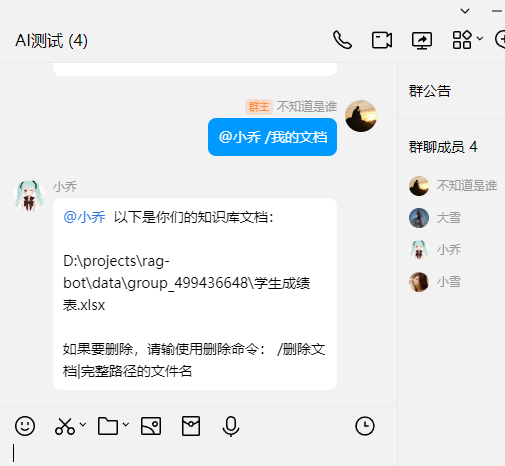

# YLBot
## Introduction
YLBot is a language model chat application that interfaces with users through a QQ messaging interface. The idea for this app has been in mind for some time. After returning from Mount Yuanlong, I felt listless and demotivated, so I decided to revisit something I was previously interested in to improve my mood, despite my advanced age. Although it seemed like a good starting point, I spent over a month researching Nonebot but struggled to understand its inner workings. Realizing that the highly encapsulated nature of Nonebot would require significant additional learning, I opted to create my own bot. Here are some benefits of YLBot: 

1. It conveniently enables various问答 (Q&A) and control operations through QQ.
2. LeveragingQQ's robust social functionality makes it easy to promote and use the bot.
3. Support for group and personal documents allows users to engage in智能 (intelligent) discussions and learning within a specific subject area.

## Disclaimer
This application is intended for research on language model conversations and Onebot standards. Please refrain from using it for illegal or criminal activities. All resources are obtained from the internet, and no cracking services are provided. For commercial use, please apply for an official QQ robot.

## Partial Interface Screenshots




## How to Use
### [Install vs_BuildTools] <https://aka.ms/vs/17/release/vs_BuildTools.exe>
### Environment Setup
- It is recommended to deploy using a conda environment. Make sure you have conda installed.
```bash
conda create -n rag-bot-pub python=3.11
git clone https://github.com/bifu123/rag-bot-pub
cd rag-bot-pub
conda activate rag-bot-pub
pip install requirements.txt
```
### Modify config.py File
Update the configuration file as per instructions, which include connecting to ollama and go-cqhttp. If you are unsure how, please refer to my Bilibili videos or join QQ group: 222302526.

### Start the Program
```bash
python listen_ws.py
```
Once started, the program listens for events and messages from go-cqhttp via sockets and runs its logic accordingly, responding as needed.

### Command List
| Command Name    | Functionality                                    | Notes                                                 |
|----------------|--------------------------------------------------|-------------------------------------------------------|
| /My Documents   | Lists all private documents or public group       | Automatically detects the user's context to load docs path  |
| /Delete Document| Deletes a document                                 | Usage: /Delete Document|Path of the document to delete |
| /Quantify Document| Quantifies a user's private document or group     | Quantification requires an idle program process; see notes for solution. |
| /Upload Document| Uploads a document to the server                  | Supports regular documents                             |
| /Document QA    | Conducts QA based on user's private or group      | Answers are limited to content within the document       |
| /Plugin QA     | Executes plugin and uses result as context        | Plugins allow for custom expansion                     |
| /Chat           | Uses a large model for conversation, no doc loading | Model can be changed in config.py                   |
| /Knowledge Base QA| Splits documents for langchain-LLM推理 (inquiry).  |
| /Document QA| Directly sends user's private documents to LLM推理.  |


## Technical Details

1. **Quantification**: To maintain stability, quantification is performed in batches, ensuring that the process remains consistent regardless of the number of documents being processed.

2. ****Document QA***: Directly sends user's private group documents to LLM推理 without splitting into vectors, preserving the context integrity.

3. ****Plugin QA*****: Sequentially calls functions where each result is passed as input to the next function until the final result is obtained. This sequence is then used as an additional context for LLM推理.

4. ****Chat*****: Defaults to a通义千问 (Tongyi Qianwen)长文本模型 (long-text model), providing conversational capabilities without requiring documents or vectorization.

5. ****Status Bug***: Stop the program, deleteuser.db, and restart it. This will fix the status issue where it would otherwise error.

6. ****Moonshot AI Kimi Model API Integration*****: Adds functionality for using Moonshot AI's KIMI models through an API, allowing users to access additional model options within their application.

7. ****Knowledge Base QA*****: Splits user documents into vectorized inputs that are sent separately to LLM推理, then retrieves the model's memory for future document recall.

8. ****Document QA*****: Directly sends user's private group documents as input to LLM推理 without vectorization, maintaining context integrity.

9. ****Moonshot AI API Integration*****: Integrates access to Moonshot AI APIs within the application, allowing users to incorporate AI services or models into their chat interactions.

10. ****Multithreading*****: Uses asynchronous calls to reduce blocking during concurrent access, improving app performance and responsiveness.

11. ****State Bug Fix***: Stopping the program, deletinguser.db, and restarting it will fix state issues where the app would otherwise encounter errors or inconsistencies.

```python
# Example of integration with a Moonshot AI API for plugin QA

def plugin_qa(text):
    plugin_results = [api_function(text), api_function(text), ...]
    combined_result = text + " Plugin Results: " + str(plugin_results)
    return combined_result

chat_model = TongyiQianwenLongTextModel()
chat_response = chat_model.generate_response(text, context=my_document_memory)

plugin_response = plugin_qa(text)
if plugin_response:
    # Combine plugin response with regular chat response
    chat_response += " Plugin Response: " + plugin_response
```

